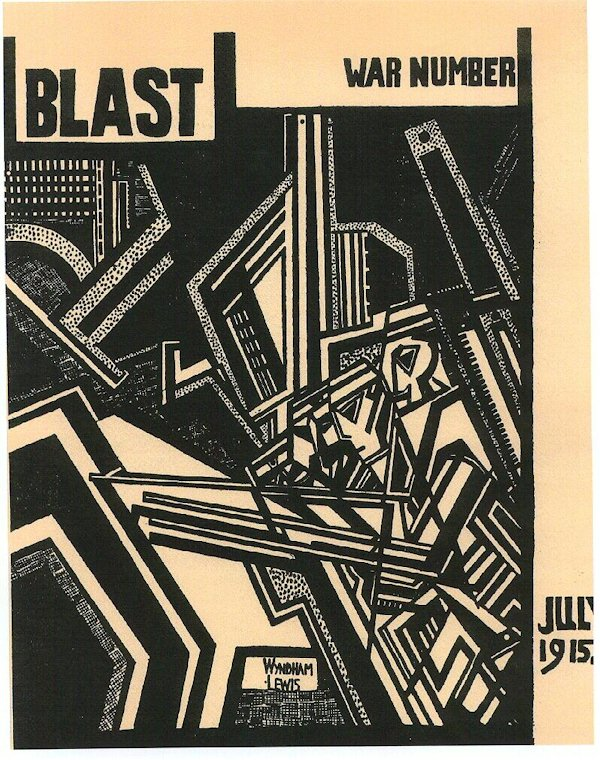
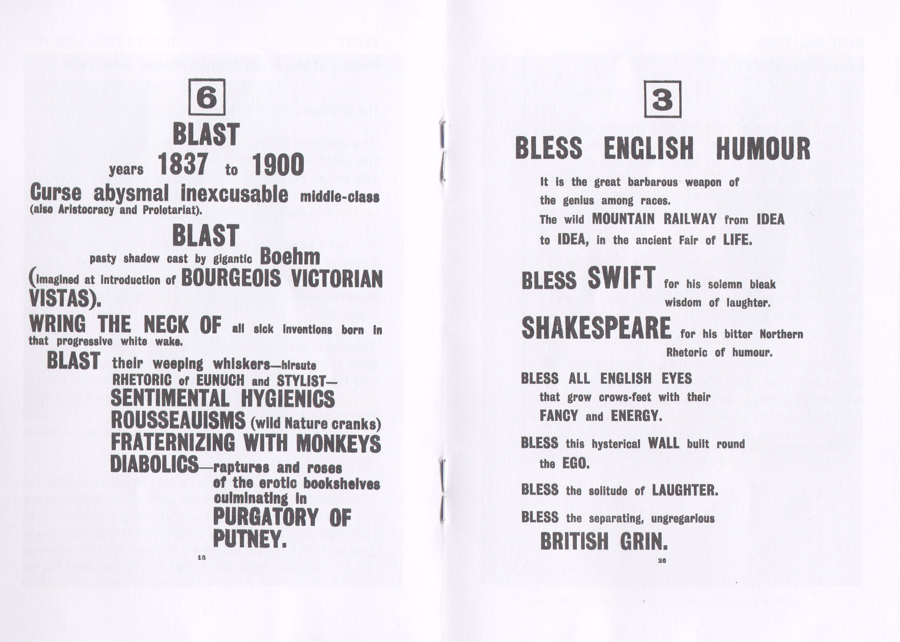
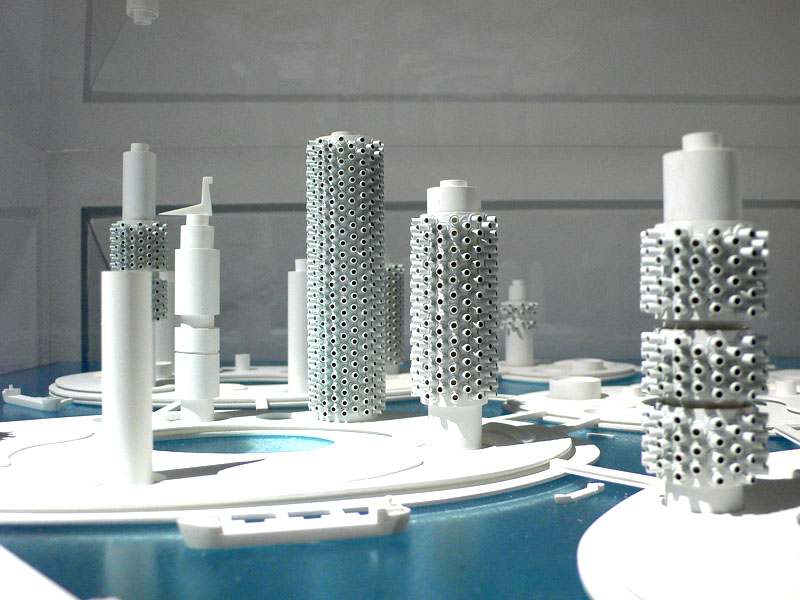
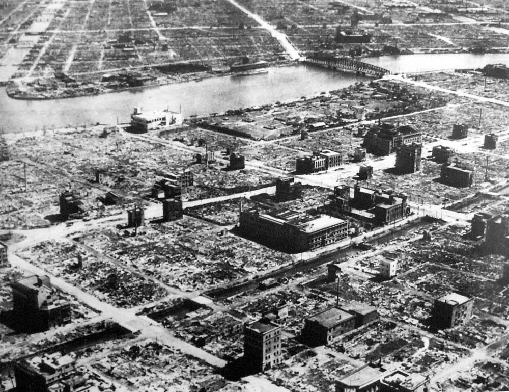
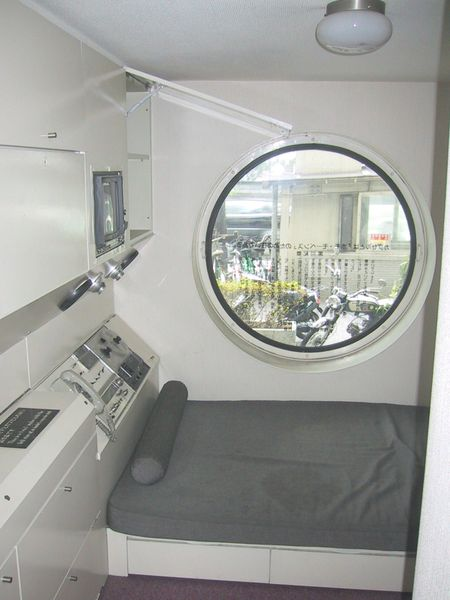
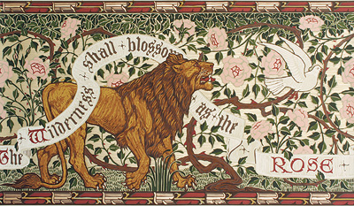

#Week 2: Survey Some -Isms

*Notebook Prompt*: Between the 1870s and 1970s, what are some notable -isms operating across art, culture, and politics? How were these -isms designed?

##Vorticism (1914-1917ish)

Manifesto(s?) in [BLAST, Review of the Great English Vortex, Number 1](http://library.brown.edu/pdfs/1143209523824858.pdf), Wyndham Lewis

####History
+ As a movement, was very short-lived: started in 1914 and did not outlast the war
+ Wyndham Lewis (largely credited as the movement's founder, though he did not coin the term(that was Pound)) tried to revive it as "Group X" but that didn't fly
* Perhaps its violence after the war was off-putting?
* Supposedly, according to [this](http://vorticism.co.uk/vpages/introduction/), were the first to popularize the magazine-form manifesto
* Same source points to democratization of Art as a driving force for its popularity (was it though?)
* Britain a major industrial power, esp. British Navy (blessed in the manifesto)

####Politics
+ Sets itself up as a violent break from the past ("BLAST", after all); mentions/disdains/blasts past movements like Aestheticism ("The Britanic Aesthete"(?), "Rousseauism")
* Violence as somehow purifying or cleansing: language of disease ("sins and infections" (11); a "lump" that bursts (32))
* Same in the figure of the hairdresser attacking Mother Nature, trimming hair into "_clean_ arched shapes and angular plots" (emphasis mine)
* In that way, seems to be bringing order to disorder, but also paradoxically the form of the piece is disordered
* Trying to be democratizing? For "everyone"; but also for "no man"? Denying/rejecting a specific audience?
* Is it about inhabiting extreme perspectives or neither? Do the two annihilate each other or something?
* Gender politics: kind of stereotypically "macho" masculine, "blasts" things for being "effeminate" and weak, "disease of femininity" (15)
* Heavy nationalist bent: England vs. France, the pride of the English Navy
* Rejects sentimentality, excess (e.g. the excess of aestheticism)

####Aesthetics
* Typeface: [Grotesque No. 9](http://www.typorn.org/article/how-blast-magazine-has-changed-literature) by Blake Stephenson (British type designer)
* Significance of an ordered/hierarchical list?
* What to make of the symbol? Is it supposed to be a top? Upside-down top?
* blockish, square type suggests brute force, stability
* Is the straightness of it a response to the diagonal lines of Futurism?
* In some ways, seems very orderly (hierarchical, ordered list, straight forceful lines); but in others, seems chaotic (e.g. random lists of images/symbols/institutions, the 3 on one page isn't centered like the rest)

####Sources/Further Reading
Baldick, Chris. “Vorticism.” _The Oxford Dictionary of Literary Terms (4 ed.)_. 2015. Web. 8 Jan. 2016.
Chilvers, Ian, and John Glaves-Smith. “Vorticism - Oxford Reference.” A Dictionary of Modern and Contemporary Art (2 ed.) 2009. Web. 8 Jan. 2016.
Lewis, Wyndham, ed. “Blast.” Blast: Review of the Great English Vortex 1 (1914). _The Modernist Journals Project_. Web. <http://library.brown.edu/pdfs/1143209523824858.pdf>
VortexMaster. “Introduction.” Vorticism.co.uk. N.p., n.d. Web. 6 Jan. 2016. <http://vorticism.co.uk/vpages/introduction/>
Yiannakopoulou, Konstantina. “How BLAST Magazine Has Changed Literature.” _Typorn.org_. N.p., 1 Sept. 2014. Web. 6 Jan. 2016. <http://vorticism.co.uk/vpages/introduction/>

##_Shintinchaisa_(新陳代謝), or Metabolism (1960-1970s)

Major Proponents:

* _Shintinchaisa_(新陳代謝) means "metabolism" in a scientific/biological sense, but can also mean "renewal or regeneration...closely related to the Buddhist concepts of transmogrification and reincarnation" (Wendelken 287)
* Architectural movement, although Metabolism's proponents did write extensively on it
* Key Text would be _Metabolism 1960—Proposals for a New Urbanism_ (Can't find an original copy, only excerpts in various secondary sources)
* Prepared for the 1960 Tokyo World Design Conference

####History
* Post-WWII era: reaction to devastation after the war (fire-bombing in Tokyo, twin bombs over Hiroshima and Nagasake) and the constant threat of nuclear warfare
* Emphasis on rebuilding, recovering after the war: metabolists saw themselves as designers of prostheses (293) creating "cyborg architecture" (?25)
* Scientific advances in biology (e.g. discovery of DNA)
* After the war, foreign occupation and reconstruction led Japanese architects to want to assert their own identity/aesthetic

####Politics
* As a nationalist project: wanting to assert tradition (somewhat) independent of foreign (esp. American) influence, "an -ism that rivalled Western avant-garde" (??)
* Metabolists may also have been anxious about the survival of their culture, both in reference to the war's destruction as well as foreign influences on reconstruction
* In response to a fear of totalitarian regimes (both that fell/were emerging): emphasized flexibility, organic growth, modularity over/against political rigidity and restraint
..* Is anything ever really "organic" rather than socially determined? Significance of modularity?
..* as part of "organic growth", old parts/capsules were supposed to be replaced by new ones
..* in response to (Western) criticism of disposability, ? emphasizes "replacement" or regeneration common in Eastern philosophies (31-2)
* Is spiritual, draws upon (Shinto?) Buddhist ideas of impermanence, regeneration
..* as a (materially-speaking) "new" Japan built over top of the old one while essentially keeping the same spirit
..* emphasis on interconnectedness
* Perhaps despite its creators' intentions, and especially as its influence spread beyond Japan, metabolism was criticized for encouraging/enabling the Western capitalist/consumerist attitude it tried to set aside
..* accused of encouraging "overworked, isolated male drone" mentality (296)

**Aesthetics**
* Supposedly rejecting visual references to (recent) past Japanese architectural traditions because they are supposedly "unpleasant[ly] naturalist—even militaristic" (289); source is vague about how they actually did this though
* use of curves more organic
* modular capsules
..* "the ideal contemplative dwelling"—in a Buddhist way? (294)
..* assertion of individuality (within the collective?), owner can restyle the capsule however she likes
..* influenced by continuous threat of nuclear annihilation, a protective shell like a bunker (remains untouched inside while the outside has gone to shit)
..* as "cyborg architecture" or hybrid of human/machine(?): the machine (capsule) and life rely on each other (25)

**Sources/Further Reading**
Goldhagen, Sarah Williams, and Réjean Legault, eds. _Anxious Modernisms: Experimentation in Postwar Architectural Culture_. Cambridge, Mass.: MIT Press, 2000. Print.
Kurokawa, Kishō. _Metabolism in Architecture_. London: Studio Vista, 1977. Print.
“Metabolism (architecture).” Wikipedia, the free encyclopedia 1 Jan. 2016. Wikipedia. Web. 7 Jan. 2016.

##Transhumanism (1957)

["Transhumanism", Julian Huxley (from _New Bottles for New Wine_), 1957](http://www.transhumanism.org/index.php/WTA/more/huxley)
* Note "Transhumanism" in its first incarnation from Huxley (Aldous Huxley's brother!); has since become very diverse movement

**History**
* [Discovery of DNA's molecular structure](https://en.wikipedia.org/wiki/DNA) by Watson and Crick in 1953, becomes conceivable that we could, eventually, alter humans on a molecular level

**Politics**
* Technological determinism: technology does not exist in a vacuum outside of social determination, nor will it automatically result in better quality of life for all of humanity
* Appeal to evolution, biology smacks of eugenics
* Always a "he"
* Humans as highly exceptional when compared with other biological organisms...because of reasons.
..*As if evolution were a teleological process with a pre-determined plan for humanity

**Aesthetics**
* language of inevitability, that this is the way things "naturally happen"
* "the universe becoming conscious of itself" (as in humanity becoming aware of itself? Or the universe having agency beyond humanity? As in the natural world will move on with or without humans so they better keep up?)
* language of "discovery" and progress

**Sources/Further Reading**
Hays, Sean A. "Transhumanism." Encyclopedia of Nanoscience and Society. Ed. David H. Guston. Thousand Oaks, CA: SAGE Publications, Inc., 2010. 770-71. SAGE knowledge. Web. 10 Jan. 2016.
Huxley, Julian. New Bottles for New Wine, Essays. London: Chatto & Windus, 1957. Print.
“Transhumanism.” Wikipedia, the free encyclopedia 7 Jan. 2016. Wikipedia. Web. 11 Jan. 2016.

##Arts and Crafts Movement (ca. 1880-1910)

Major Proponents: William Morris, Augustus Pugin, John Ruskin, Elizabeth Wardle

**History**
* Britain growing industrial power, child labour, poor working conditions, other Dickensian business, national pride etc. etc.
* Wealth inequalities persisted, but weren't quite so stratified as they used to be (rising middle class, "white collar" jobs)
* Following Marx, saw industrial working conditions of the time as exploitative, dehumanizing and wanted to set itself apart from that
* Influence of [John Ruskin](https://en.wikipedia.org/wiki/John_Ruskin) (esp. _Modern Painters_): craftsmen/labourers should be involved in all aspects/stages of production, from design to execution, promoted "enobling work"
* Separation of the spheres (idea also largely attributed to Ruskin) & division of labour: women = hearth & home, men = public sphere; but also growing suffrage & women's rights movements at turn of century

**Politics**
* Emphasized the rights of the producer/worker, community practice (e.g. [Art Workers Guild](https://en.wikipedia.org/wiki/Art_Workers_Guild), informal and, eventually, more formal education)
* Though it purported to be democratizing ("Good Taste for All!"), the things the Arts & Crafts made were too expensive (_because_ of the craftsmanship) for anyone but the upper and upper-middle classes to buy
*Was not (perhaps could never hope to be) wholly independent of industrial capital: often relied on patronage/investment from upper-MC/factory owners for start-up costs or to produce their works
* (sometimes in theory, though not always in practice) privileged the handmade over machine-made
..*for some Arts and Crafts proponents, it was less against machines in general and more about the alienation/labour conditions that arose around them
* In our present day, is our own fascination with the Arts and Crafts movement a nostalgia for pre-digital times? Funny, because shows that even nostalgia is never new (pre-industrial or pre-digital)
* Arts and Crafts, as a movement, spread not only to other parts of the Western world (Ireland, America, Europe, etc) but also to India, China, etc. (far less talked about for obvi reasons), so might think of "which Arts and Crafts" as much broader than is usually talked about
* Gender:
..* Many women worked in the A&C movement, though there was a separation/divison of labour/craftsmanship within A&C: women exclusively did embroidery, lace-making, etc. while men did all the silversmithing, glass-making, etc.
..* Women were not allowed in the Art Workers Guild >:(, but created their own Women's Guild of Arts, though Callen argues that it came too late (1907) in the Movement to have much of an impact within the broader A&C
..* In this way, reinforces traditional divisions of labour rather than being progressive, but the "rising profile of female craft industries" cannot be separated from proactive efforts/campaigning by women for increased access to political, educational, and labour institutions

**Aesthetics**
* Emphasis on "nature", both as a thematic aspect as well as in the sense of "natural" or "organic" materials and appearances (e.g. not painting over/otherwise disguising one material as another)
* Medievalist aesthetic might be a sort of nostalgia over the pre-industrial

**Sources/Further Reading**
Blakesley, Rosalind P. The Arts and Crafts Movement. London ; New York: Phaidon, 2006. Print.
Callen, Anthea. “Sexual Division of Labor in the Arts and Crafts Movement.” Woman’s Art Journal 5.2 (1984): 1–6. JSTOR. Web.
Coomaraswamy, Ananda Kentish, and Rama P. Coomaraswamy. The Essential Ananda K. Coomaraswamy. Bloomington, IN: World Wisdom, 2004. Print. The Perennial Philosophy Series.
Thomas, Zoë. “At Home with the Women’s Guild of Arts: Gender and Professional Identity in London Studios, c.1880–1925.” Women’s History Review 24.6 (2015): 938–964. Web.

##Autodidact(ic)ism, or Self-Help (from forever ago until now)

Working definition (admittedly fuzzy): the practice of self-directed learning, or teaching yourself (usually a skill) outside of formal institutions

**History**
* has been happening even since ancient times, often with an explicitly spiritual or theological purpose and extends beyond Western tradition, e.g. Islamic philosophy in the Middle East (see Ben-Zaken)
* 19th-century: emphasis on self-improvement or refining "taste" (a la Smiles' [_Self-Help_](https://en.wikipedia.org/wiki/Samuel_Smiles#Self-Help) or _Great Expectations_) the middle-class, mutual improvement societies, women scholars, education & slavery
* Early to mid 20th-century: "rags to riches," the Horatio Alger myth
* In more modern times: explosion in mid-century of self-help books, glorification of the "self-made" innovator or entrepeneur (middle-class white male, think Bill Gates or Steve Jobs), "From Zero to Maker"

**Politics**
* On the one hand, seems to be explicitly political or subversive if you take the long history of class struggle, women and people of colour autodidacts who circumvent formal structures of education made to exclude them
..* Can even feed back into said professional structures, as in Ladies Learning to Code
* On the other hand, seems to reinforce institutional privileges that already exist:
..* relies heavily on leisure time for "added labour" (see _Self-Help Inc._), acces to resources/knowledge to "teach yourself," environments that encourage and foster learning
..* at times, can be rather individualistic, essentialist, rely on narratives of the singular genius
..* How subversive or radical is it? Still succeeding within the same capitalist system or do you change the system from within?

**Aesthetics**
* Not too sure about this one, especially since I haven't chosen a text yet
* For most self-help texts, common move is to reference a parable and then extract/expound upon some nugget of wisdom
* explicitly didactic (expected to be), often giving instructions in imperative form and repeating them throughout, a "catchy" phrase
..* would assume a certain kind of audience? Class, gender, race, etc.?
* Considering _Lifemanship_, which is a parody of self-help books

**Sources/Further Reading**
“Autodidacticism.” Wikipedia, the free encyclopedia 6 Jan. 2016. Wikipedia. Web. 11 Jan. 2016.
Dalton, Harlon L. “Horatio Alger.” Racial Healing: Confronting the Fear Between Blacks and Whites. N.p. Web. 9 Jan. 2016.
Fisher, Pamela, and Roy Fisher. “The ‘Autodidact’, the Pursuit of Subversive Knowledge and the Politics of Change.” Discourse: Studies in the Cultural Politics of Education 28.4 (2007): 515–529. www-tandfonline-com.ezproxy.library.uvic.ca (Atypon). Web.
Madsen-Brooks, Leslie. “A Synthesis of Expertise and Expectations: Women Museum Scientists, Club Women and Populist Natural Science in the United States, 1890-1950.” Gender & History 25.1 (2013): 27–46. EBSCOhost. Web.
McGee, Micki. Self-Help, Inc. Makeover Culture in American Life. Oxford ; New York: Oxford University Press, 2005. voyager.library.uvic.ca Library Catalog. Web. 9 Jan. 2016.
Pomata, Gianna. “Amateurs by Choice: Women and the Pursuit of Independent Scholarship in 20th Century Historical Writing.” Centaurus 55.2 (2013): 196–219. EBSCOhost. Web.
Radcliffe, Christopher. “Mutual Improvement Societies and the Forging of Working‐class Political Consciousness in Nineteenth‐century England.” International Journal of Lifelong Education 16.2 (1997): 141–155. www-tandfonline-com.ezproxy.library.uvic.ca (Atypon). Web.
Richard Edwards. “Amateurism and Professionalism in Work and Learning.” Journal of Workplace Learning 26.6/7 (2014): 406–417. emeraldinsight.com (Atypon). Web.
Rodrick, Anne Baltz. “The Importance of Being an Earnest Improver: Class, Caste, and ‘Self-Help’ in Mid-Victorian England.” Victorian Literature and Culture 29.1 (2001): 39–50. Print.
Williams, Heather Andrea. Self-Taught: African American Education in Slavery and Freedom. Chapel Hill: University of North Carolina Press, 2009. Print.