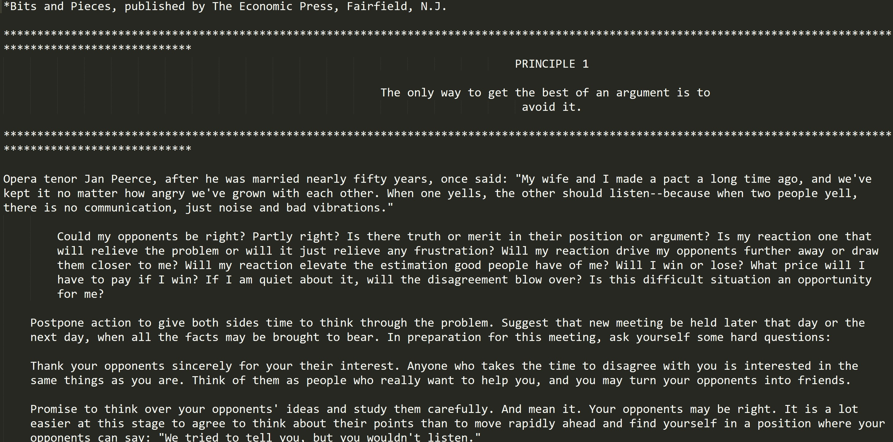

##Week 10: Reverse it.

####Notebook Prompt

Reverse the order of your text. Read it backward. Interpret the text as a performance.

####The Exercise

[Link to file.](reversed.txt) I reversed it at the paragraph level.

Overall, the results weren't very coherent at all, which I think exposes how tightly constructed and conventional (or at least for today) Carnegie's prose is. It certainly looks very much like a text that I put in reverse--but maybe that's because I knew it would be? Some of this recognition comes from knowing other conventions and patterns of argument, though. For example, the reversed text starts with a footnote. Quotes are introduced after they appear. This also supports what I've said before about self-help being a kind of pseudo-academic genre.

One thing about reversing a text (as would making a [poetry Twitterbot](https://twitter.com/JustToSayBot)) is that it teaches you to see language as a series of modular parts, whether semantic or syntactic (reversing a text gets at the"operating system of language"). I find the overall structure of *How To Win* modular in some ways, even if moving the parts around made it somewhat nonsensical because they are meant to follow a linear narrative. For example, even if the order of words/sections is not arbitrary (it probably wasn't and, as critical readers, we certainly wouldn't assume it to be anyway), there is a way in which the book seems to present itself as modular by separating itself into distinctive and progressively smaller parts--sections, chapters, principles, lists, etc. In this way, the self-help book seems to act like a textbook: extract what you can/want from the text and ignore everything else. Carnegie's rhetoric also seems modular in the sense of excerpting bits and pieces from other people's works and combining them to make his own narrative. Though Carnegie likely intended the anecdotes and biographies to be illustrative examples, it sometimes seems like other people's words and stories so outweigh his own that he hardly contributes any of his own original thoughts at all--despite the fact that he is often promoted as an "original" thinker for his time.

Another interesting thing that emerged from this exercise is that one of Carnegie's main rhetorical strategies might be suspense or surprise (this would not be like a textbook or else not a very good one). In the original text, the principles always come last in each chapter whereas they are first in the reversed text. Is it better pedagogy to be clear about what you're teaching from the outset?

I also kind of like that it almost starts with a series of questions, and then the phrase, "Postpone action." In the preface, Carnegie emphasizes that this *How to Win* is an "action book" and the book is always telling you to *do* stuff. In this sense, opening with questions that prompt reflection and deferral of action is interesting and perhaps a bit counterintuitive. Surprisingly though, the original text still kind of opens with a call to "Distrust your first instinctive impression." So maybe not. This particular excerpt also seems to bookend itself rather neatly. It opens and closes with references to other works or other people (*Bits and Pieces* and opera tenor Jan Peerce). Carnegie also repeats himself quite often and this became more apparent to me in the reversed text for whatever reason (e.g. "Your opponents may be right" vs. "Could my opponents be right?")
