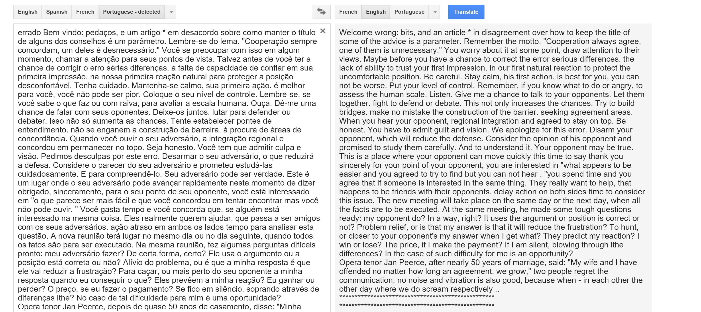
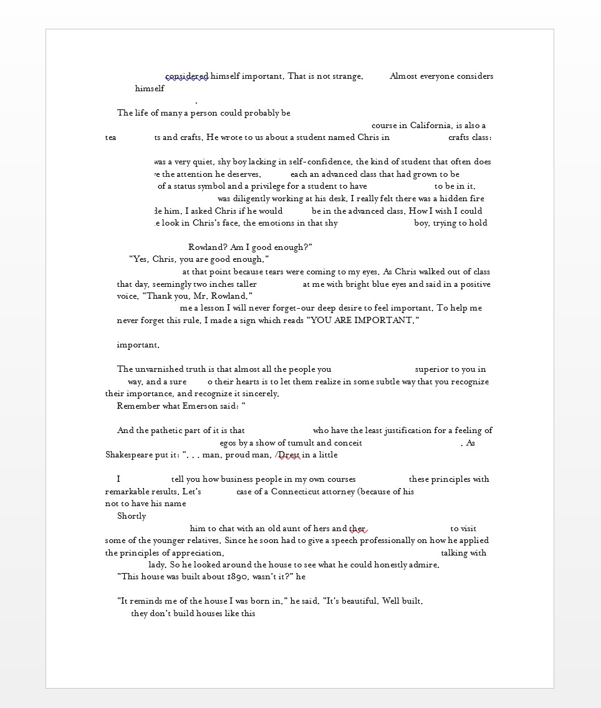
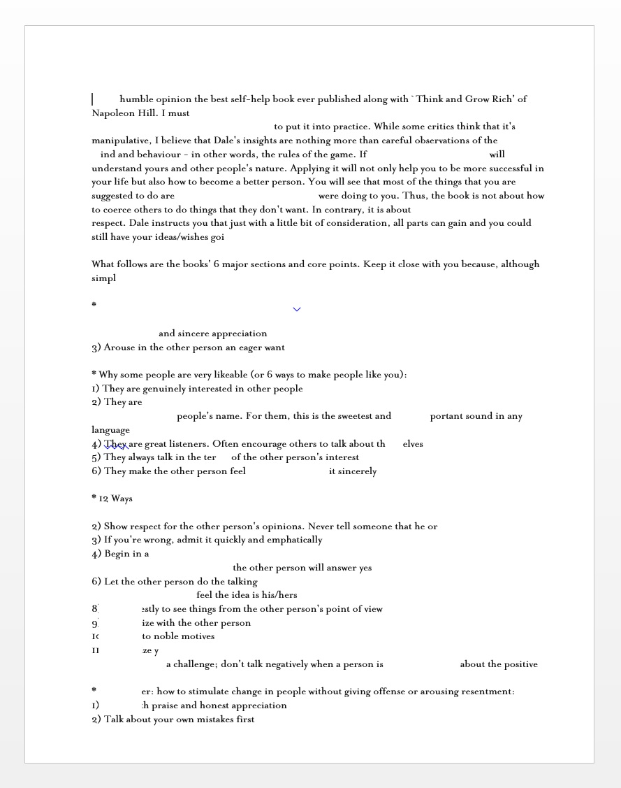
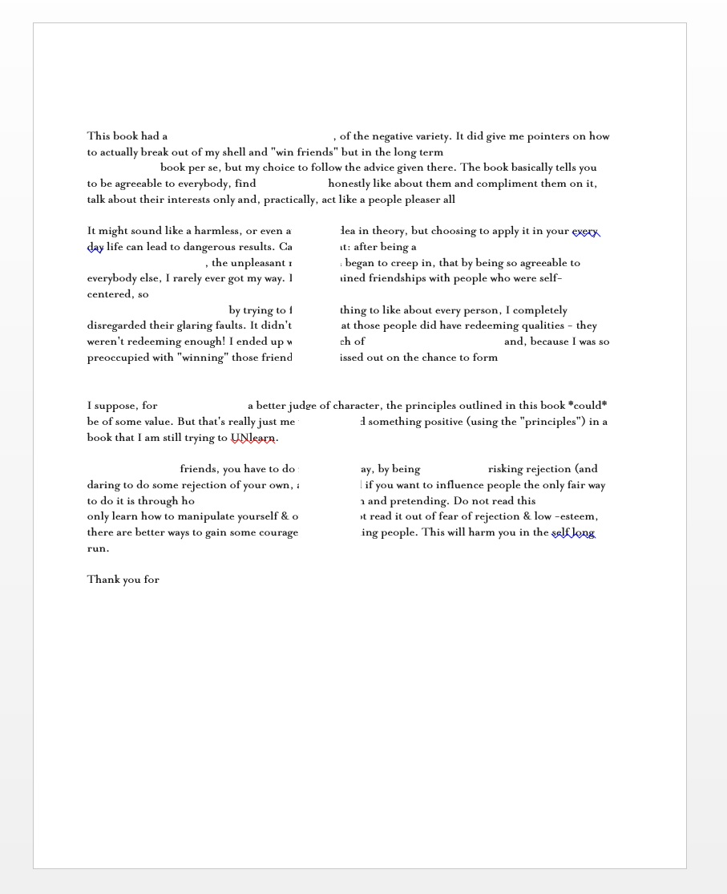
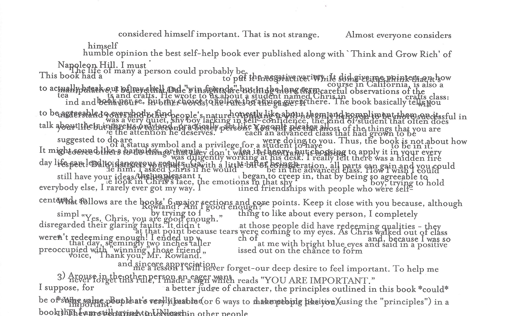
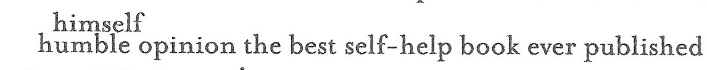

##Week 11: Redact it. Glitch it.

####Notebook Prompt

Hide, mask, or erase aspects of your text. Interpret the text as a redacted text. Now repeatedly compress and bend your text. Interpret the text as a glitch. If you wish, then feel free to turn your text into a bot, too.

####The Exercise

I followed [Owens' instructions](https://blogs.loc.gov/digitalpreservation/2012/11/glitching-files-for-understanding-avoiding-screen-essentialism-in-three-easy-steps/), which we went over in class. But I didn't find the result all that interesting or persuasive. It became inexplicably colourful, though, but I don't know why or how that even happened:

I came up with two other ways of my own for redacting and/or glitching my text.

####Method 1: Remediation as Translation, Translation as Remediation

>"Welcome wrong: bits, and an article in disagreement over how to keep the title of some of the advice is a parameter...We apologize for the error" --Dale Carnegie, as interpreted through Google Translate x8</blockquote>

This approach is partly inspired by discussions that have come up around Angie's work on Cubism and [this video of someone singing "Let it Go"](https://www.youtube.com/watch?v=2bVAoVlFYf0) after running it through Google Translate a few times. Mel may have also mentioned it and I forgot; Mel and I are usually on the same wavelength (for better or worse). I ran a short excerpt of *How to Win* (the same one as the [plain text exercise](https://github.com/eltiffster/ENGL508Notebook/tree/master/Week7)) through Google Translate eight times: English to [Telugu](https://en.wikipedia.org/wiki/Telugu_language) to Spanish to Vietnamese to Hindi to Chinese (traditional) to French to Portuguese, and finally back to English.

<figure>
	
	<figcaption>I chose languages for which I could find a print translation.</figcaption>
</figure>

I am particularly interested in this kind of "glitch" because, as [the Google Books blurb](https://books.google.ca/books/about/How_To_Win_Friends_and_Influence_People.html?id=yxfJDVXClucC) about it proudly proclaims, *How to Win* "has been translated into almost every known written language" (and maybe a few unknown ones too???). I wonder how well the text carries across linguistic and cultural differences, especially since one of the book's unspoken assumptions, not to mention a major selling point, is an appeal to universality. Carnegie's words are invaluable and you should therefore (literally and figuratively) buy them because they are so timeless and applicable to everyone. Perhaps (mis)translation could cause "glitches" in understanding?

For this method, the glitch occurs in the gap between the machine-readable and human-readable. Here, I am thinking about Menkman's definition of a glitch as

>"a (actual and/or simulated) break from an expected or conventional flow of information or meaning within (digital) communcation systems that results in a perceived accident or error. A glitch occurs on the occasion where there is an absence of (expected) functionality, whether understood in a technical or social sense. Therefore, a glitch, as I see it, is not always strictly a result of a technical malfunction.""

In this prototype, the "glitch" isn't necessarily technological--or at least, not in a strict sense. Rather, it is, similar to what Menkman describes: an error in communication. The algorithm can still "work" by providing an output. But as syntactically and semantically meaningful sentences, the output is unsurprisingly garbled. Moreover, the Google text box requires everything in it to be plaintext so any meaning that would, in the print copy, be encoded in the formatting (e.g. margins, italics, contrasting fonts) gets lost.

The [notes for this week](http://jentery.github.io/508/notes) include the questions, "How does your glitched text address questions of agency? How are you in control? And not?" With this prototype, I can tell Google which language(s) to translate and in what order, but I have very little control over the processes that intervene in between. I don't know Telegu, Spanish, Vietnamese, etc. (even my reading knowledge of French and Chinese is limited) so I can't "correct" as it goes -- and I certainly don't know how Google's algorithms work.

Grammatical glitches (mostly) aside, [the resulting text](WelcomeWrong.txt) is hilarious and fascinating. In a creepy sort of way, it almost seemed aware of its own glitchiness (as in the quote with which I started this section). Some of it was still intelligible and closer to Carnegie's meaning in the original and some of it contradicted either *How to Win* or even itself in the same line. In a weird way, maybe this is not glitchy at all: Carnegie's advice is self-contradictory anyway (he advocates being "genuinely" interested in others yet only in service of getting what he himself wants). At least the prototype apologizes for it.

####Method 2: Glitchy Grangerizing

This prototype is inspired by a couple of my previous exercises ("Make it Metadata" comes to mind). I was thinking about the times I've noted that it can hard to trace anything in *How to Win* with certainty since there is a lot of "noise" from all the different versions and opinions that have cropped up since Carnegie first published it and which clog search engine results. If you've grown up in a Western North American context, it's hard to read *How to Win* for the first time because you're so likely to be influenced by what others have told you about it or what you assume it to be. I was looking for a way to prototype those assumptions, experiences, and popular reception into the text itself. That is, like Menkman's "feedback artifact," I was looking for a way to prototype the noise back into the signal itself.

To make this second prototype, I first copy/pasted a section from the typeface prototype into Microsoft Word. Then I redacted parts of the text by changing the font colour to white, changed the margins slightly, and added white text boxes to create vertical redactions that could cut across words. Then I grabbed a couple reviews of *How to Win* on Amazon.com and Goodreads.com (one positive and one negative) and ran them through the same process. Finally, I printed all three documents on the same sheet of paper. The plan was that the text would remain redacted/missing/blank in some places, but illegible in others.

<figure>
	
	
	
	<figcaption>All three documents. I printed/layered them on in order from left to right.</figcaption>
</figure>

<figure>
	
</figure>

I thought this prototype worked pretty well. For this one, I was curious about the ways in which redactions become blanks for other kinds of meaning and valences. Here, I'm thinking of Holzer's work (see Craze's "In the Dead Letter Office") but also this really cool game called ["Blackbar"](http://www.macworld.com/article/2067004/blackbar-review-simple-witty-and-politically-engaged-word-based-puzzle-game-for-iphone.html). (In Blackbar, the slightly ridiculous, dystopian "Department of Communication" has redacted your friend's messages and you have to repair the redactions to advance the plot.) I also thought of Karen's glitchy blank/form exercise, where he intended people to fill in specific blanks (white space between text) but they wrote in different areas of white space instead.

<figure>
	
</figure>

The prototype could be interpreted as image or as text, but I found it more interesting to interpret it as text. Sometimes, there were some interesting juxtapositions in which the reviews either reinforced or flat-out contradicted Carnegie's text. I wonder what different results I might have gotten if I had changed the orientation of some of the text--printed bits of it vertically instead of horizontally, for instance, or flipped it into a mirror image of itself. OR if I had lined up the text so that it wasn't clear when Carnegie's words were bleeding into other people's. Hmm.
