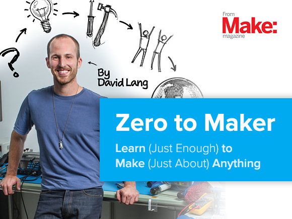
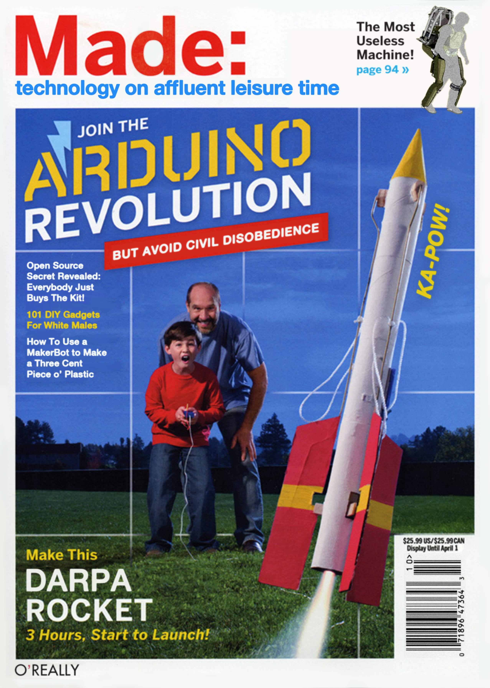

##Week 12: Capstone Workshop

####Notebook Prompt

Instead of running through the "Repair It" exercise, we workshopped ideas or prototypes of our capstone prototypes (capstone prototypes being "______ It," which we come up with ourselves).

I actually had two ideas in mind for this one.

###Thaw It

"Thaw It," as we've mentioned before in 508, asks "What would the text look like if it took place in the present historical moment?" This question might seem a little odd, since the obvious answer is it would look however the current or most recent edition of *How to Win* looks (I *think* that *How to Win* has never been out of print since it was first published, although it's no doubt changed quite a bit from its first edition until now). So the more interesting question might be to ask what current analogue I can see between *How to Win* and contemporary movements in autodidactism.

To which my answer would be maker culture.

>"Zero to Maker *is David Lang's story of going from a curious onlooker to active participant in the maker movement. He shares the most important lessons he learned, and how the experience helped him start OpenROV--a DIY community and product line focused on open source undersea exploration. Ready to take the plunge into the next Industrial Revolution? Here's the roadmap."

*Zero to Maker* is, at least according to my first impressions when reading, intended to act as a motivational/self-help book for those looking to get into maker culture and, I would argue, it exposes itself to the same criticisms as I wrote/talked about in Weeks 1-3. [Debbie Chachra](http://www.theatlantic.com/technology/archive/2015/01/why-i-am-not-a-maker/384767/) and Garnet Hertz (below) make similar critiques. (To be clear, theirs came first and they inspired/informed my own.)

If I did "Thaw It," I would probably make a magazine cover similar to Garnet Hertz's -- maybe "Win: social manipulation on your own time" or something like that. Really, this would be an experiment in making the comparison between maker culture and autodidactism/self-help, which has been in the background of my work anyway, more explicit.

###Make It A (Twitter)Bot

I haven't gotten very far with this at all--either conceptually or technically. Conceptually, I haven't quite articulated why do this in the first place. Initially, my thinking had more to do with Twitter as persona. Based on my work so far, which has sort of oscillated between forgery and counterfactual, I also thought of making either an autodidactic bot (a bot that "learns" from some kind of rudimentary AI) or mixing Carnegie's words with someone else's and seeing what the results are. Perhaps things will become clearer once I decide on a corpus. ([Jentery's feedback](jenterysNotes.txt) in this folder for reference.)

Technically, I haven't gotten very far with it at all at this point. I've tried following [Zach Whalen's instructions](http://www.zachwhalen.net/posts/how-to-make-a-twitter-bot-with-google-spreadsheets-version-04/) and they work fine. But I'm thinking for this prototype, I need a bit more of an understanding of how it's working -- for example, what are Markov chains, even? How would I get python running on my machine to connect and post to Twitter?