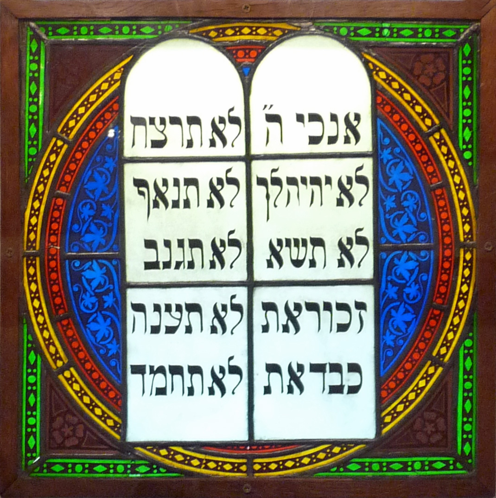
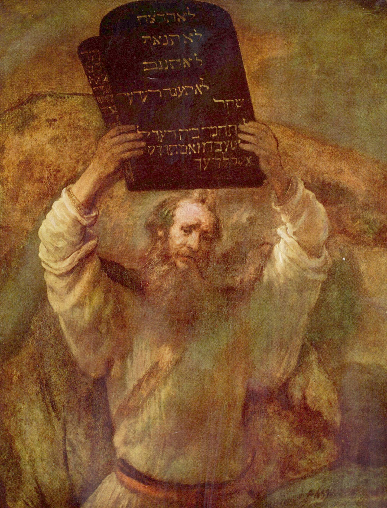
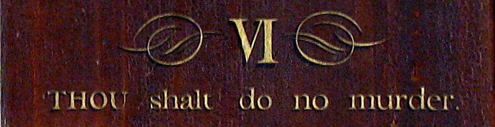

#Week 4: Image It

###Prompt

Digitize or acquire your text as a series of page images (TIFF, JPG, PNG). Interpret the text as an image on a screen.

See Jentery's notes on ["Approaching Text as Images"](http://jentery.github.io/508/notes) for more detailed instructions and prompts.

###Arrangement and Form
* Fragmentation: blocks of prose, then a principle, then a whole list of principles that are all stylized differently
* Gutter created by the codex format almost acts as the centre if it was an image (normally, as text we would be inclined to ignore it)
* Large and prevalent: the list ("In a Nutshell")
* Space largely to accentuate the principle and the list; that is, white space to create contrast and draw the eye to particular points, especially combined with borders
* Doesn't suggest movement; suggests stability, authority, steadfastedness...aggressive?
..* not as aggressive as something like Blast, maybe. A bit more subtle
..* some similarities though: use of clean lines, some caps (but not ALL CAPS), playing with fonts and sizes
..* not completely balanced either, though. There is some whitespace underneath the list that is conspicuous

###Meanings and Subject Matter
* Figure and ground: like typical books, black type on a white background
* Landscapes: islands of text (list, principle) that separate themselves from each other, // fragmentation
* Instrument of meaning, vehicle of values: rathr upfront, aggressive about its message
  * a series of proclamations, or even commandments
  * a similar format/look for what we might imagine the Ten Commandments to be (see below): border suggests a tablet, an ordered list of simple, declarative, imperative sentences that stand out on their own
  * interesting connection since some critics have suggested the Bible to be the first ever self-help book
  * connections: idea of private study, an epiphany, looking to it for spiritual/secular guidance, emphasis on interpretation

* Legibility vs. illegibility: the text is almost entirely legible, but maybe less so towards the gutter where the text is getting sucked in
* as a similar aesthetic (not deliberate) to zines/Fluxxus kits: fuzzy, photocopied look when scanned
  * Implications? Same impetus towards interaction, similar move towards democratizing knowledge (or art if you take it as the "art" of winning friends and influencing people) & distributing it to the masses, demystifying the Art in a way
* Can we consider it a democratic multiple?
  * definitely wouldn't be part of the fine-art establishment: mass-produced, rather banal
  * especially considering its economic success, can it really be political subversive or anti-establishment in the same way? Does it depend on the individual using it?
  * was made deliberately for profit
  * already kind of ruined it in my earlier presentations

###Relations and Entanglements
* As a subject, would be pretty much as aggressive as you can be (without being BLAST, maybe, but perhaps HTW takes itself more seriously)
  * sort of like Uncle Sam, hailing you as an individual
* Doesn't prompt dialogue at all, really. Just wants you to follow its orders
* Open or closed as a private/public object (cf. Drucker)?
  * aligns itself with the private, like a chrysalis so that you can pretend these skills are naturalized
  * but encourages a public performance, or at least a persona
  * likely had more influence than Dale Carnegie really imagined
* Refuse or invites interaction or intimacy?
  * Can seem a little cold: very strong lines, dark/bolded aggressive font in some parts
  * Could it also be inviting? Whitespace an invitation to annotation, to write up the image