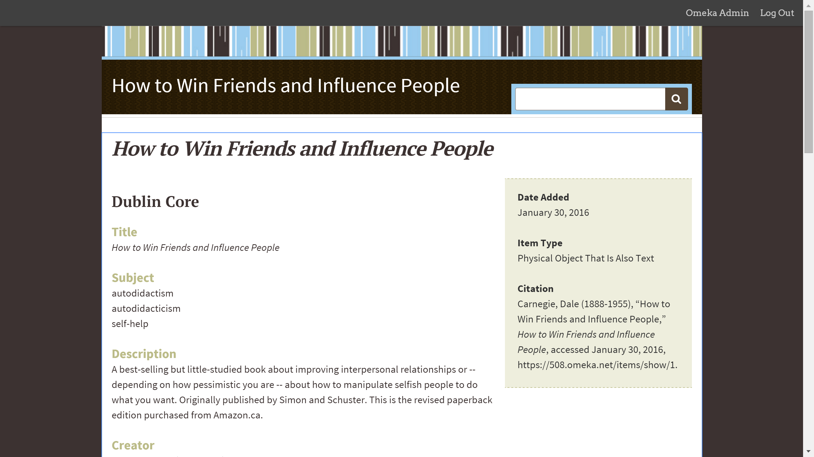

#Week 5 - Put Some Metadata On It

###Notebook Prompt

Articulate ten metadata fields for your text and provide data for each field. Interpret the text as metadata. See [Jentery's Week 4 notes](http://jentery.github.io/508/notes.html) for more.

**Link to Omeka Exhibit**: [https://508.omeka.net/items/show/1](https://508.omeka.net/items/show/1)

###Where/How has it been described before?
As a [product on Amazon](http://www.amazon.ca/How-Win-Friends-Influence-People/dp/0671027034/ref=sr_1_1?ie=UTF8&qid=1454206759&sr=8-1&keywords=how+to+win+friends+and+influence+people)
As a [book in the UVic Library stacks](http://voyager.library.uvic.ca/vwebv/holdingsInfo?bibId=724104) (It's for "research")
  * due to popular demand, it's been placed on library reserve
On [Google Books](https://books.google.ca/books?id=Ni88SAAACAAJ&source=gbs_ViewAPI&redir_esc=y)

###General Thoughts
* Made an object record for it in Omeka
  * Interesting because it added another layer of interpretation over it (that is, metadata interpreted through Dublin Core interpreted through the Omeka platform)
  * Is "live" and explorable or discoverable
  * As an object worthy of exhibition: Self-help books are generally considered "low" culture, if it even counts as culture at all
    * seems to be something crass about it
    * normally would never make into a gallery, museum, or even Special Collections unless it was a copy of note (e.g. the one Dale Carnegie owned)
    * highlights the role scarcity plays in archiving: would never be found in any of those places because it's so ubiquitous
* Found Dublin Core to be almost ridiculously flexible, so I had some fun with it
  * Descriptions are often pretty bland (deliberately, so it won't "interfere" with the audience's interpretation) but my description may have gone too far into interpretation and informal, idiosyncratic language
    * It is really hard to resist analysis.
    * Cf. discussions we've already been having about metadata as creative act or as design (especially in Alana's case of an aggressively "design-less" government document), it doesn't seem possible to create a metadata entry that would *not* somehow influence interpretation in some way
  * for "Scope" I put "As relevant as ever before"
    * As a category, seems a bit weird in a historical, "the past is never past" kind of way
    * Common kind of refrain for those who are trying to sell the book, or else calling attention to how well it has already sold
    * What is the role of (supposedly) universal applicability? Both in information and metadata
    * How much of our expectations do we inherit from previous curators of the archive?
  * Physical object vs. text
    * This class (and the Victorian Book as Object class) always seem to push on that distinction so I just made a 3rd, arbitrary category ("Physical Object That Is Also Text")
    * I liked messing with the categories, but IRL, I probably wouldn't have done this since it makes the object less discoverable

###Structure
* More or less like a typical non-fiction book: sections, chapters, pages
* Probably exists in multiple different formats and versions across all kinds of platforms
* Because it's a "canonical" self-help text, it's hard to say how much it is tethered to people's expectations and how much it came to shape people's expectations of self-help books

###Description
* It would be pretty "generic" but see just above
* As an abstract entity
  * comes with all the expectations of being an object of pop culture -- can you ever really read it "for the first time" if you grew up in a Western, North American culture?
* still very much tied to the author's status (as a successful autodidact)
* What would it look like as a dropdown menu?
  * Maybe each section/chapter would be a dropdown menu with each principle as an option?
* "Flat" in the sense of being assertively unambiguous
  * In that sense, the metadata would seem to fit the content
    * If metadata "flattens" an object in a way, then *HTW* could also be said to be reducing complex social interactions into relatively simple, digestible principles of behaviour

###Discoverability
* In terms of textual/bibliographical criticism, it seems virtually impossible to find an original 1st edition copy
  * Not just because they're rare, but because the "noise" of metadata from every other copy/version would probably drown it out
  * That would be a very BIG data project
* As a cultural icon (i.e. having a very recognizable title)
  * Would it make it more or less discoverable?
    * It's kind of an unusual title so probably wouldn't be confused with anything else
    * But then again, it's been parodied so often that people might lose sight of where it came from (back to the idea of data as "noise")