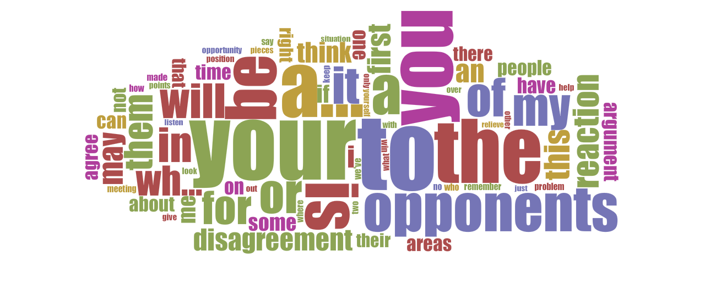
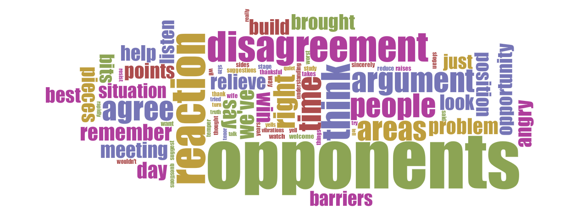

##Week 6 and 7: Make it ASCII. Mark It Up.

####Notebook Prompt

Generate an ASCII (or plain text) version of your text, removing all formatting. Interpret the text as plain text. Then encode your text in HTML5. Interpret it as markup.

####Text as Plain Text

* Loses all the formatting in italics, the emphasis on certain "commands"
  * Aesthetic/formal characteristic as well as a semantic one
    * i.e. you lose the organization of the page (statements, then explanation as an unordered list) as well as the emphasis on those statements
*Not as much privacy in a way? Or at least easier to see
  * The paperback format as more easily portable, concealable
  * Cf. Drucker, the idea of "openness" or "closed" as a characteristic of the codex format
  * A screen might be easier to peek at...but then you can maybe hide your screen window more easily
* Lose the codex format, i.e. Text as Plain Text must be scrollable text
  * The footnote on the first page is now pushed to the end of the plain text document
* No more page numbers or book/section titles along the top
  * Exposes how they act as a navigational tool
    * This book is almost obsessively subdivided into parts, sections, chapters, principles, etc.
    * e.g. This would be Ch. 1 ("You Can't Win an Argument") containing Principle 1 ("The only way to get the best of an argument is to avoid it"), all of which is in Pt. 3 ("How to Win People to Your Way of Thinking") of *How to Win Friends and Influence People*
    * You could, theoretically, not read the parts in order or only read certain parts
    * Chapter, section titles are written very colloquially -- act more like hooks than descriptions, in a way
  * Plain text, though, would be navigable in a different way (i.e. Ctrl-F)
    * Maybe more exact or fine-grained, but also maybe [less generous](http://www.digitalhumanities.org/dhq/vol/9/1/000205/000205.html)
      * That raises the question of whether *HTW* (or self-help books more generally) are meant to be more like reference guides (i.e. not meant to be read in order or even in their entirety) or more like narratives (i.e. front to back, in order)?
* How is it processed?, aka I ran it through Voyant
  * For the word clou,d I ran it once without excluding stop-words (left), and once while excluding stop-words (right)

* Also recorded the word frequency: 534 words with 265 unique words
  * "your" and "you" were most common pronouns; unsurprising, already expected and knew there would be a lot of imperative form
  * "opponent" is interesting, but not entirely unexpected
    * the idea of competition, or ["one-upmanship"](https://en.wikipedia.org/wiki/One-upmanship) if you are a fan of Potter's parody
    * that you would, at least initially, consider the other person an "opponent" seems needlessly antagonistic (even aggressive?), or maybe that's just because this section is on arguments
  * after adjusting for stop words, this is what I got (top 20 words):

Word | Frequency |
---- |----------:|
opponents |	9 |
reaction | 5 |
disagreement | 4 |
think | 4 |   
agree | 3 |          
areas | 3 |         
argument | 3 |            
people | 3 |            
right | 3 |            
time | 3 |           
angry | 2 |           
barriers | 2 |           
best | 2 |           
bits | 2 |           
brought | 2 |           
build | 2 |           
day | 2 |           
help | 2 |           
just | 2 |          
listen | 2 |           

* wonder what the results would be for each/all the sections...
* The text is also online at archive.org, both as an [EPUB](https://archive.org/details/HowToWinFriendsAndInfluencePeopleDaleCarnegie) (popular ebook format) and [audiobook format](https://archive.org/details/HowToWinFriendsInfluencePeople)
* Dale Carnegie is dead, but I'm sure his estate is still collecting lots of $$$ from this book since it has been reprinted so many times
* As I mentioned in last week's notebook entry, try to keep track of all the textual variations would seem to be impossible since it's so popular
  * The copy I have has been edited by Carnegie's wife "in the spirit of the honing and polishing of a finely made tool" (xiii)
  * Interesting because it is also often advertised as "timeless" (i.e. universally applicable), somehow out of place and history
    * appeal to essential humanistic thinking?
* Would it work for aliens if we sent it into space...
  * They might find it oddly informative about human rituals and behaviours in an outside observer kind of way
    * kind of like the narrator in an Edith Wharton novel (although that has some uncomfortably colonial undertones)
  * Would it make the aliens more or less friendly? More or less likely to attack humanity? Would they think humans are assholes?

####Text as Markup (HTML)

* As an exercise in thinking about form and content
  * What is difference between whiz bang (for its own sake) and a critical choice about form/content? Do I make it pretty in HTML because I want it to be pretty or because I want it to more closely emulate the experience of reading the original?
  * We have certain expectations for how a web page should look (i.e. not like something from the 90s)
* What HTML really foregrounded for me were the different voices at work in the text
  * Carnegie himself, *Bits and Pieces*, "Opera tenor Jan Peerce"
  * leads to questions of labour and attribution, did these people actually say the things Carnegie attributes to them? (sometimes people are notoriously misquoted and there's no way to tell)
* Self-help as a pseudo-academic genre
  * often trying to set up author as an educated authority, what is the place of personal experience?
  * drawing on examples as "evidence" (anecdotal), certainly not rigorous in the same way we would expect academic publications to be
  * quotations often just say the same thing in different ways -- is this part of the self-help genre's draw?
    * in this, I find similarities in Nerdwriter's [analysis of Donald Trump's rhetoric](https://www.youtube.com/watch?v=_aFo_BV-UzI)
    * can often feel like a list of platitudes...perhaps it just cycles through them until you feel as though one applies to your life?
* Question of labour
  * no author for *Bits and Pieces*
  * at the beginning of the book, Carnegie writes that he has had a team of interns who gathered stories of famous, successful people; presumably, *HTW* is the result of this gathering and analysis of what made them succesful
    * none of those interns are ever credited; if anything, their labour is used to bolster Carnegie's own ethos, set him up as an authority
    * is also pseudo-academic in a way -- presents itself as if it were a systematic study of success
  * For Jan Peerce, it really seems like more of a name drop than an attempt at citation
  * Can HTML intervene in calling attention to attribution, labour, and personhood?
    * the hyperlink? (obviously not possible in Carnegie's day, where you would have had to take his word for it)
    * Now, supposedly, things are more easily discoverable and verifiable, but they are also more easily falsifiable
      * could also be drowned out by other, more easily searchable information
* The block quote
  * I decided to put the imagined "hard questions" in a blockquote instead of Jan Peerce's words (in the paragraph below it), which one might have expected instead
  * I followed the way it was formatted in the original instead
    * the "hard questions" were formatted like a blockquote, in their own indented paragraph while Jan Peerce's words were not
    * Why did Carnegie do this?
      * To call attention to his own words over Peerce's, probably
      * Is that an attempt at empathy? (as in Carnegie trying to model/inhabit the position of reader)
        * often connected to the ways in which Carnegie encourages the reader to empathize with their "opponent"
  * The whole question of empathy in this book is pretty complicated, if not problematic
    * It's not that Carnegie necessarily gives bad advice
      * it *would* be better to listen to someone in an argument instead of just yelling back out of anger
    * The question is whether or not this "empathy" is for self-serving ends...or can we ever even reach empathy? What are the limits of empathy?
      * at least for Carnegie, he has a rather pessimistic view of humanity: he thinks humans are selfish creatures anyway
    * There often seems to be a dissonance between what Carnegie's advice says to do and his combative language that I find kind of grating