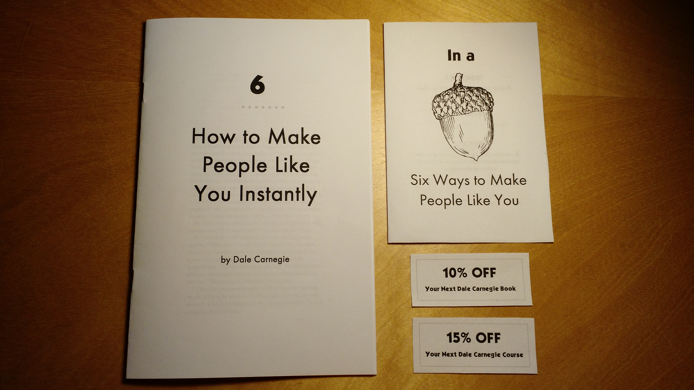
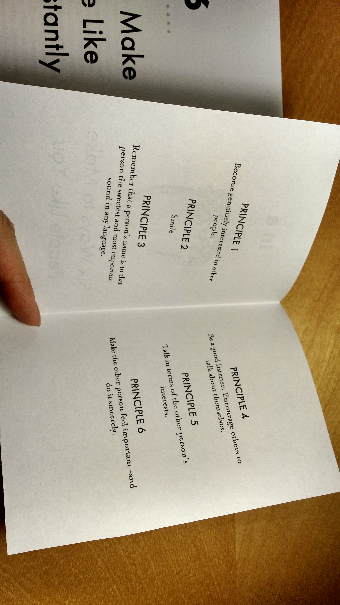
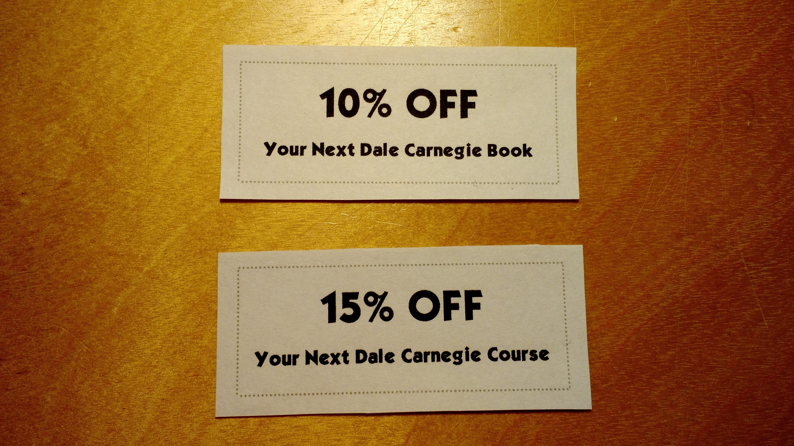
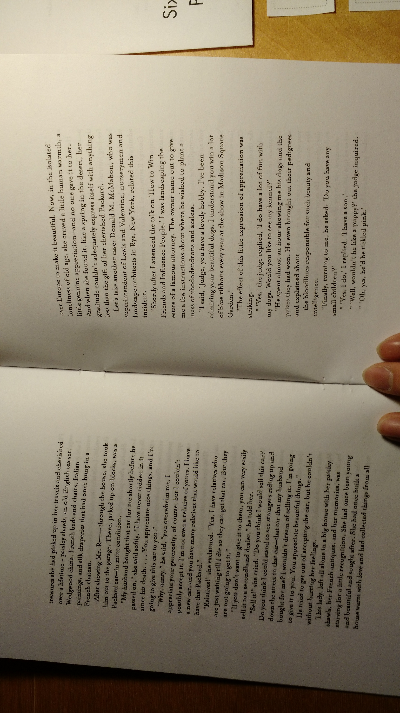
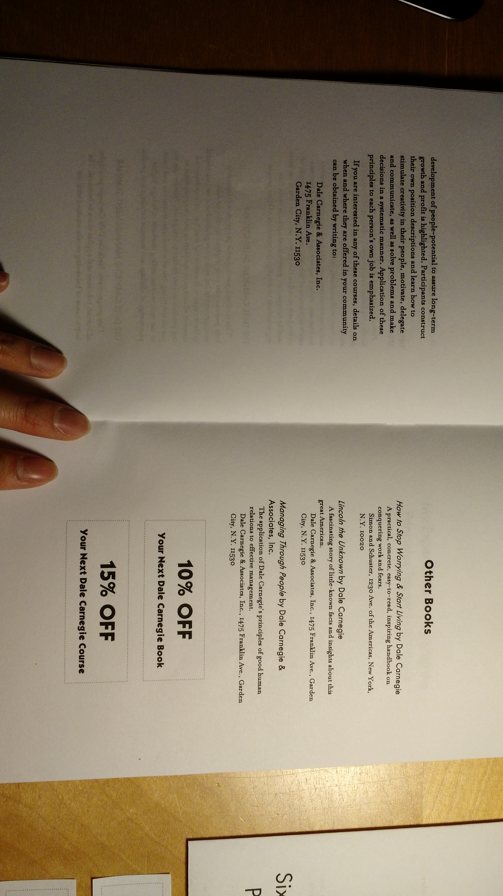
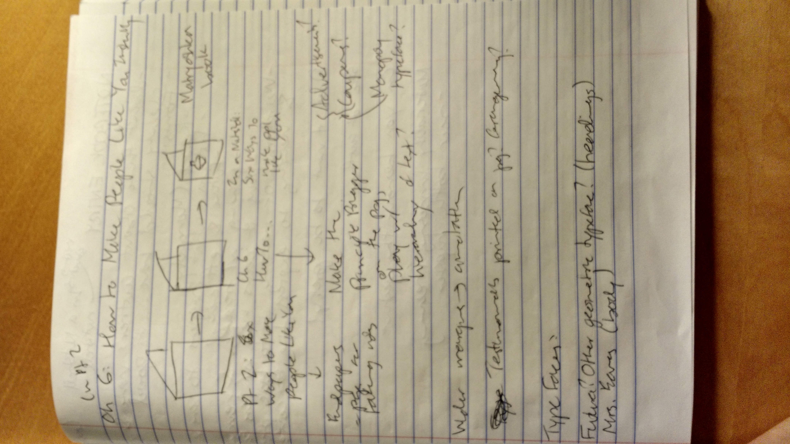
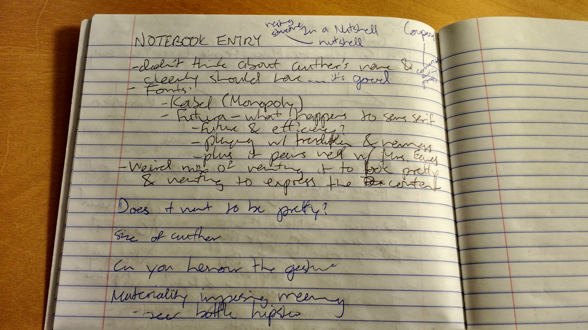

##Week 8: Change the Typeface. Print + Assemble It.

####Notebook Prompt

Change the typeface of your text, print it, and assemble it as a booklet. Interpret the text as type.

####The Component Parts

I printed and assembled a chapter of *How To Win* (more specifically, Ch. 6 of Pt. 2: "How to Make People Like You Instantly") using a combination of 3 fonts: Kabel, Futura, and Mrs. Eaves. Since the structure of the book is (almost excessively) divided into sections and subsections (book into parts into chapters), I decided to make the compartmentalization more explicit or exaggerated in my prototype.

As in the ["Image It" exercise](https://github.com/eltiffster/ENGL508Notebook/blob/master/Week4/README.md), there is a section, titled "Six Ways to Make People Like You," that is both visually and semantically separated from the rest of the chapter: it has a border around it, is printed in a different font, and functions as a summary of the previous chapters/principles in its part rather than follow naturally from the preceding text.

To reflect this in my booklet, I separated "Six Ways to Make People Like You" into a smaller booklet that can be nested into the larger one. Being a self-contained "nutshell" in its own way, I can imagine a reader tucking this into a pocket or pinning it on a wall. This would facilitate the repeated study and reflection that Carnegie recommends in the base text (see "The More You Get Out of This Book, the More You'll Get Out of Life!" or "Nine Suggestions to Get The Most Out of This Book"). The wide margins would also make it easier to annotate the book--another practice that Carnegie recommends.

I also included some cut-out coupons in the booklet. In my base text, there are sections at the end that list Carnegie's other books and lectures, with an invitation to mail or contact Dale Carnegie and Associates, Inc. if you are interested. For me, this highlights how *How to Win* was very much a commercial enterprise that were imbricated in Carnegie's other commercial endeavours. For example, Carnegie writes that *How to Win* is based on material from his public lectures and one can imagine that his books in turn made his lectures more popular. I made this economic motivation and connection across formats more explicit with the coupons.

####The Typefaces

One major question that I've been thinking about is whether I can make a prototype that expresses and invites skepticism or ambivalence--without being an [outright parody](https://en.wikipedia.org/wiki/Stephen_Potter#Gamesmanship_and_freelance_writing)? Though I've been (almost exclusively) criticizing *How to Win*, I wonder if there is a way to prototype that still reveals or explores why autodidactism is so enticing in the first place without asserting that this desire is simply the product of false consciousness. This is partly because of my own ambivalence about autodidactism (I have personally benefitted greatly from it) and that, as a strategy, it does work for some individuals who, in turn, might become role models for others. The other part of it is that *How to Win* does not necessarily provide bad advice, per se: yes, we probably should admit when we are wrong and try to understand situations from other people's points of view. But there are always small details in language that frame these outwardly generous gestures as a form of competition; I find these very grating and frustrating.

I'm not sure I was entirely successful at prototyping that ambivalence in the booklet I made. It *is* subversive and a little playful.

**Kabel**
Kabel, according to [Wikipedia](https://en.wikipedia.org/wiki/Kabel_(typeface)), is a typeface found in Monopoly. I find this especially fitting since Monopoly [initially started](http://www.theguardian.com/lifeandstyle/2015/apr/11/secret-history-monopoly-capitalist-game-leftwing-origins) as an anti-monopolist game created by a woman autodidact, Lizzie Magie, but is better known today as the brainchild of its male "inventor," Charles Darrow. I see a parallel between Monopoly--a game that ironically became pro-capitalist and pro-monopolist despite its origins--and the way in which narratives of autodidactism can appear to be democratizing (everyone has an equal opportunity to succeed) but often ends up reinforcing existing inequalities. In Monopoly's own history, the fact that Darrow, a man, receives credit (and a whole lot of $$$) as the singular genius behind Monopoly while Magie does not, makes this apparent.

<figure>
	
	<figcaption>Kabel typeface designed by Rudolf Koch. Image care of GearedBull on Wikimedia Commons.</figcaption>
</figure>

**Futura**
I'll admit that I mostly picked this font because my base text is entirely in serif so I wanted to see what it would look like in sans-serif--especially since the title of the first edition was [in sans-serif font](https://en.wikipedia.org/wiki/File:How-to-win-friends-and-influence-people.jpg). Futura, according to the [always-accurate Wikipedia](https://en.wikipedia.org/wiki/Futura_(typeface)), exudes an air of "efficiency and forwardness" that speaks to the text's emphasis on constant, dedicated improvement.

<figure>
	
	<figcaption>Futura typeface designed by Paul Renner. Image care of Sherbyte.</figcaption>
</figure>

**Mrs. Eaves**
I was initially going to use Baskerville because I thought it would be interesting to use ["the most trustworthy font"](http://www.fastcodesign.com/3046365/errol-morris-how-typography-shapes-our-perception-of-truth). But then I came across Mrs. Eaves: a typeface named after Sarah Eaves, the generally uncredited collaborator of John Baskerville. [Mrs. Eaves (the typeface)](https://en.wikipedia.org/wiki/Mrs_Eaves) looks very similar to Baskerville except for a lower x-height. I wanted to use Mrs. Eaves as a comment on the question of uncredited labour: Carnegie had a team of research interns but only mentions them to persuade the reader of the text's (and his own) authority. They are never named.

All 3 typefaces on one page:

####Notes and Sketches

All in all, I like the way my booklet turned out well. It feels kind of clean and elegant and I imagine it being something that Carnegie (or maybe one of his unnamed, uncredited interns) would hand out to people on the street to persuade them to buy the whole book. Although I do wonder whether the text even deserves this treatment. Does the text want to look pretty?

