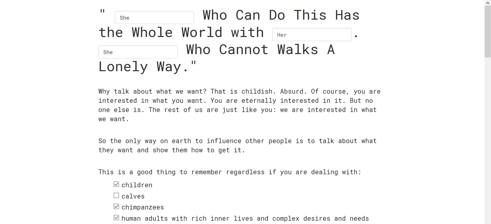
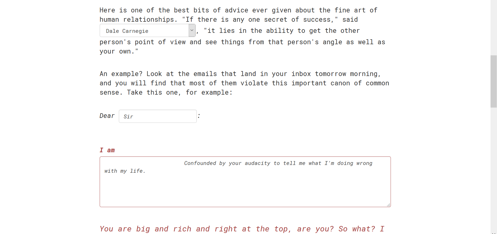
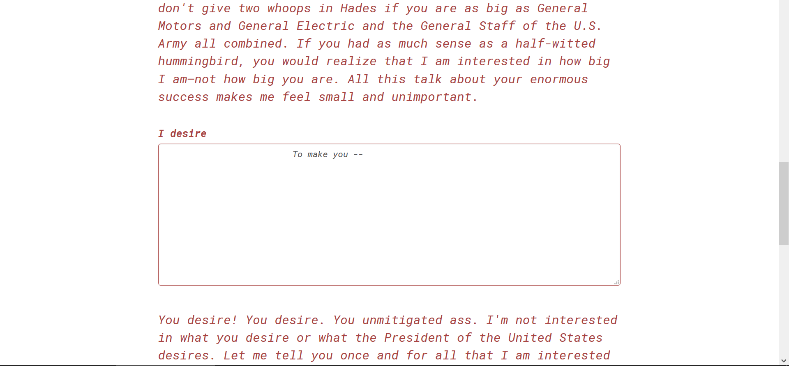

##Week 9: Make It a Form.

####Notebook Prompt

Convert your text into a fillable form. Have at least three other people complete it. Interpret the text as a document.

####Where (or Who) are the Blanks in *How to Win*?

After reading Gitelman, I would say the most obvious kind of blanks in *How to Win* are nominal blanks (I keep noticing them in Victorian lit and now I finally know what to call them). There is also a "Mr. John Blank" in one of the chapters. As Gitelman notes, these blanks refer to specific persons. But, in *How to Win*, there are less explicit blanks. what of the the "blanks" that remain ambiguous, never quite specified or explained? Here, I'm thinking of the way Dale Carnegie, as a literal person as he once lived, is something of a blank -- an identity we no longer have access to and which his readers or promoters fill in themselves. There is also the blank of Carnegie's team of interns, who were never identified or credited. But I am also thinking of the blanks created by pronouns: the royal "we" or the readerly "you" that may or may not be filled in (you could (maybe) be a critical reader who does not identify with this role). Do these blanks also refer to specific people? How do they mean? Several things the blanks could point to in Carnegiean list fashion:

  1. Interpellation or hailing in the Althusserian sense. *How to Win* hails you as a subject and you answer. 
  2. A space of aspiration, potential growth, (moral or immoral) improvement or refinement (Cue Matthew Arnold tie-adjusting).
  3. An absence. The voice of the reader is absent in *How to Win*, where it's a one-way "conversation."
  4. A persona. We are all somewhat of a blank to each other since we can never be all things to all people.

Another list. The issues/goals/intents I'm thinking about when making this prototype:

  1. As an intent, to "write back" or speculate an alternative to Carnegie. To allow options that Carnegie never gave his audience through some measure of interactivity. Here, would it be a forgery or a counterfactual (see Jentery's notes for defs of types of prototypes)? In this case, this prototype could maybe even be a scenario or a parody.
  2. The problem of empathy, which Carnegie is trying to teach in the chapter I've chosen (Chapter 3: "He Who Can Do This Has the Whole World With Him. He Who Cannot Walks a Lonely Way"). Can we ever truly empathize with another person whose embodied experiences are different from ours? Should we (see [here](http://auntiepixelante.com/empathygame/) and [here](http://www.digitalrhetoriccollaborative.org/2016/03/14/remaking-optophones-an-exercise-in-maintenance-studies/)? Who is Carnegie trying to empathize with and why?

####The Form Itself

[Link to the form.](http://eltiffster.github.io/ENGL508Notebook/Week9/form.html) (Note: the Submit button doesn't actually do anything. Sorry not sorry.)

The form itself could be considered a kind of letter (or email) to Carnegie. I excerpted parts of this chapter and kept them almost entirely the same except for what I redacted/blanked out for the sake of the form. In doing so, I wanted to retain Carnegie's "voice" or "personality" that has become such a major selling point for the Carnegie estate. Since the whole list thing is becoming a theme in this notebook entry -- and because I can't discuss ALL the blanks -- I'll go through 3 of the major things I did or wanted to do with this form.

The first things I blanked were the "He" pronouns in the chapter title, which I replaced with a text field inviting people to fill in their preferred pronoun. Looking (hunting?) for blanks in this exercise also prompted me to think about the ways in which the "neutral" pronoun of "He," in this sense where Carnegie is retelling a proverb, is a blank or situation that the reader is supposed to place themselves into. It's fitting for self-help/Carnegie, really -- a supposedly neutral, democratic space that anyone can fill and yet is actually skewed towards a certain segment of the population. Putting the blank where I did allows for more gender identities and choice than Carnegie ever offers, especially as an arbitrary text field instead of a dropdown or button list which would restrict the number of choices. Here I was thinking of the (lack of) options for "gender" on forms I typically fill out as well as [restroom genderator](https://twitter.com/restroomgender).

But if readers have more choice (I know we discussed how the idea of more interactivity = more agency is vexed in seminar but bear with me), then Carnegie also has a chance to respond to -- or, maybe more accurately, berate -- the reader. Even when the form is something like a conversation, it's interesting to think about who might get the last word in that case. The people I asked to fill out the form stopped typing more or less as soon as they saw Carnegie's "response" (one person laughed and said that I was now messing with people and this is technically true) but I can imagine someone stubbornly typing out what they were going to say. Or maybe even berating Carnegie back?

I'll admit that this was also kind of a joke -- a concession to parody more than a counterfactual. For this one, I wanted to poke a bit more at the idea of the persona and/or defining yourself as data (metadata in Gitelman's terms) and "pouring yourself in" (also Gitelman): if you could only describe yourself in one file, and one file only, what would you choose? What do you project in representing yourself? What is left out? What is legible to (or perhaps misread by) others?

>"It's an odd sensation, though, because as a life long test-taker it feels like there should be a correct way to approach this."

This is something one of the people who filled out my form said to me afterwards and I think that maybe it means the prototype was a success? Maybe one of the things a form does best or is intended to do, and which Carnegie also does with *How to Win*, is this quantifying and measuring of the self. (Maybe I am conflating forms and tests here but we sure tests aren't really a kind of form?) It is something akin to pathologizing the audience, I think -- where do you "lack" or not measure up? These self-conceptions (or conceptions of others) have material consequences, of course. Here, in addition to Gitelman, I think of ["The Changing Face of America"](http://ngm.nationalgeographic.com/2013/10/changing-faces/schoeller-photography) (h/t[Miriam Posner's blog](http://miriamposner.com/blog/whats-next-the-radical-unrealized-potential-of-digital-humanities/)) and the Indian Status Card that Alana brought into class (which, presumably, she had to fill out a form to get). Forms can act as gatekeeping devices and restrict or allow access to resources. Autodidactism, as it's traditionally thought of, is often seen as a way of being successful despite not having the same access to resources (rags to riches). Making it a form -- a tool of bureacracy -- would seem to turn this on its head.
